# TrustShield 🛡️

TrustShield is a real-time intelligent security application designed exclusively to protect users from malicious phishing links before any damage occurs.

## 📱 How to Install

Follow the step-by-step visual instructions below to install TrustShield and grant it the required security permissions.

---

### Phase 1: Pause Google Play Protect
Before installing the debug APK, temporarily pause Google Play Protect so Android doesn't block the unverified installation.

1. Open the **Google Play Store** app and tap your **Profile Icon** in the top right.
<br>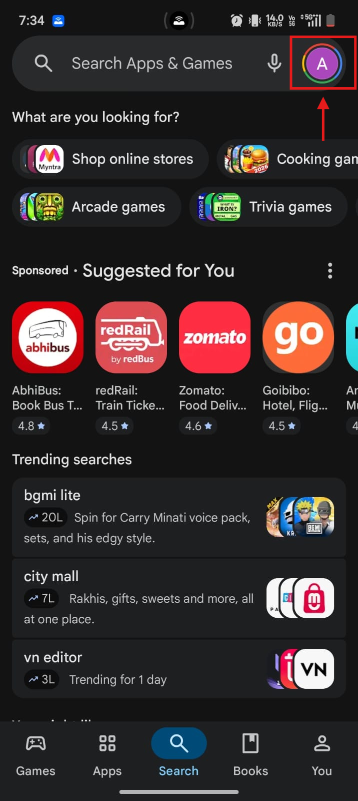<br><br>

2. Tap on **Play Protect** from the menu.
<br>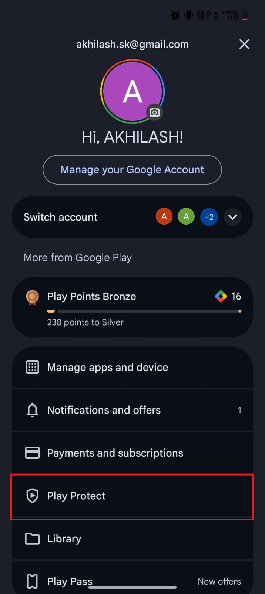<br><br>

3. Tap the **Settings (gear icon)** in the top right corner.
<br>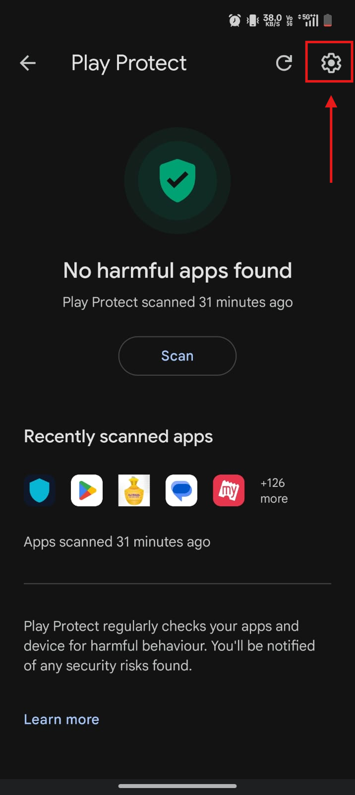<br><br>

4. Toggle off **Scan apps with Play Protect**.
<br><br><br>

5. When the confirmation dialog appears, tap **Pause** (this temporarily pauses scanning for 24 hours so it turns back on automatically).
<br>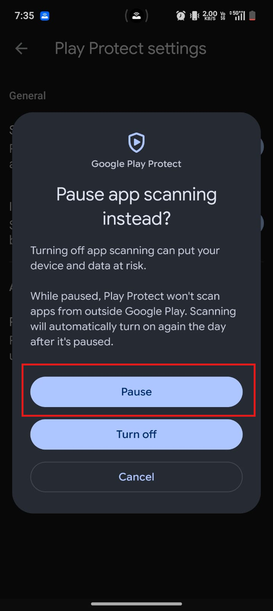<br><br>

6. Verify that app scanning shows **"App scanning is paused"**.
<br>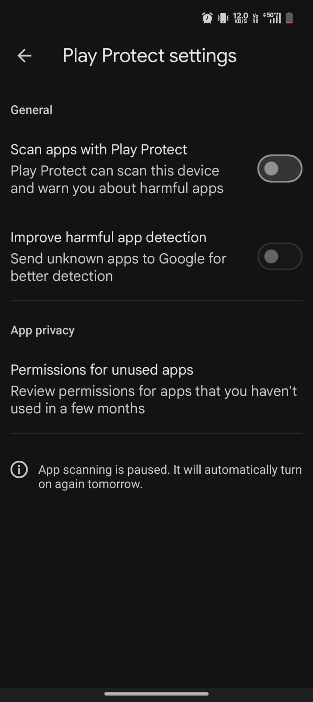<br><br>

---

### Phase 2: Download & Install APK

7. Open the download portal at **[https://akhilash-sk.github.io/TRUST-SHEILD/](https://akhilash-sk.github.io/TRUST-SHEILD/)** and tap **Download for Android**. If Google Chrome displays a *'File might be harmful'* warning, tap **Download anyway** to complete the download.
<br>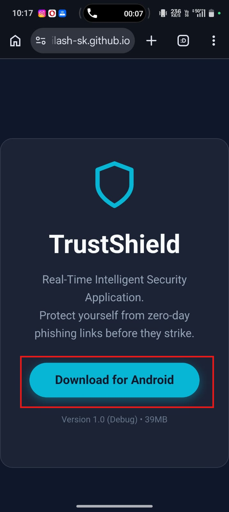<br><br>

8. Open the downloaded `TrustShield-debug.apk` file from your notification bar or Downloads folder and select **Package installer** to install the application.
<br>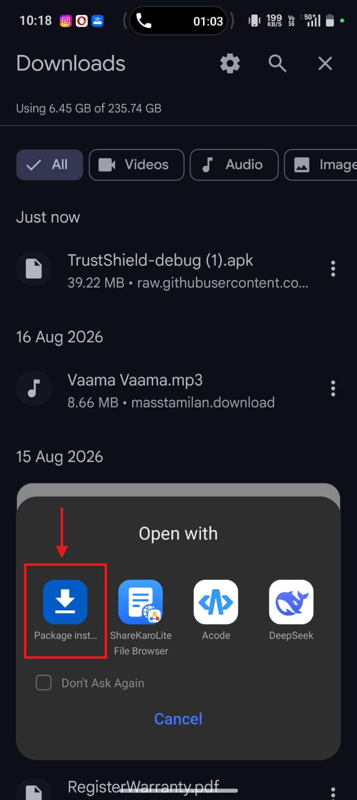<br><br>

---

### Phase 3: Allow Restricted Settings for Notification Access
Because TrustShield intercepts notifications to protect against zero-day phishing in real-time, sideloaded apps on Android require manually allowing restricted settings.

9. Long-press the **TrustShield** app icon on your home screen or app drawer and tap **App info** (ℹ️).
<br>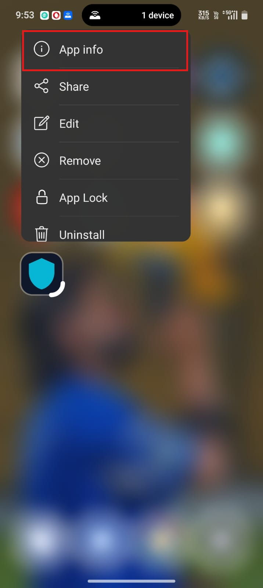<br><br>

10. Tap the **three dots (⋮)** in the top right corner and select **Allow restricted settings** (authenticate with your PIN or fingerprint if prompted).
<br>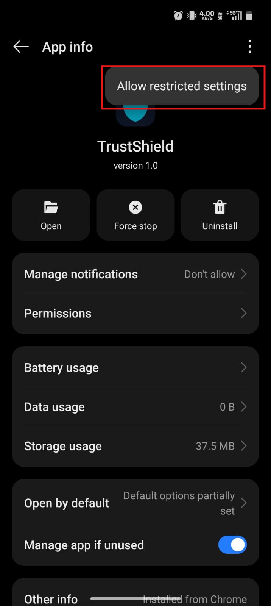<br><br>

11. Open the **TrustShield** app and tap **ENABLE NOTIFICATION ACCESS** on the Special Access screen.
<br>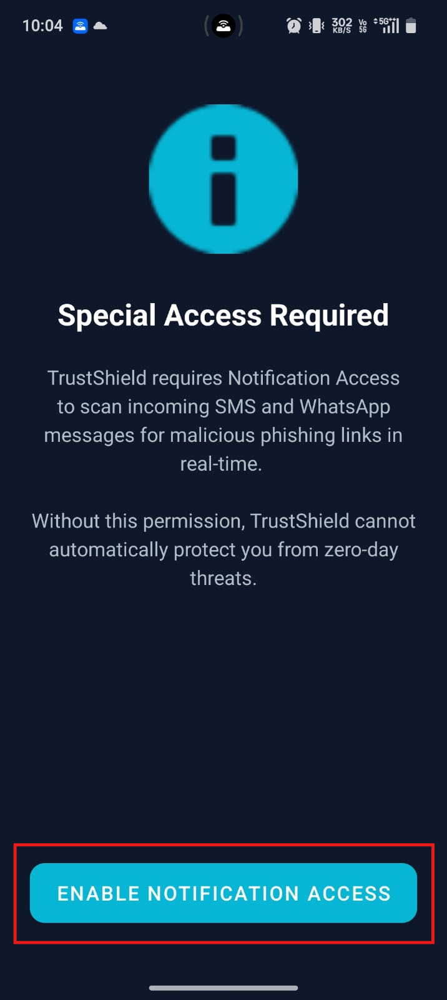<br><br>

12. In the Android **Device & app notifications** list, select **TrustShield**.
<br>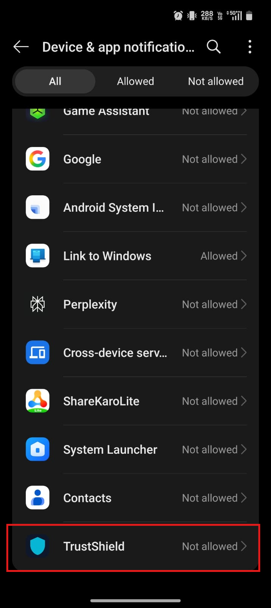<br><br>

13. Turn on the **Allow notification access** switch and tap **Allow** on the confirmation dialog.
<br>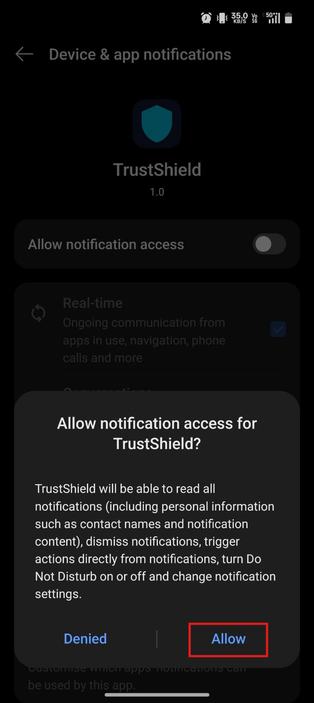<br><br>

14. Confirm that the **Allow notification access** toggle is enabled (blue / ON).
<br>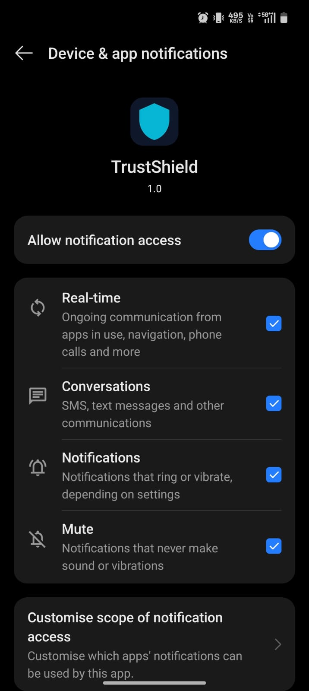<br><br>

15. Return to the TrustShield app; when the system prompt asks **"Allow TrustShield to send you notifications?"**, tap **Allow**.
<br>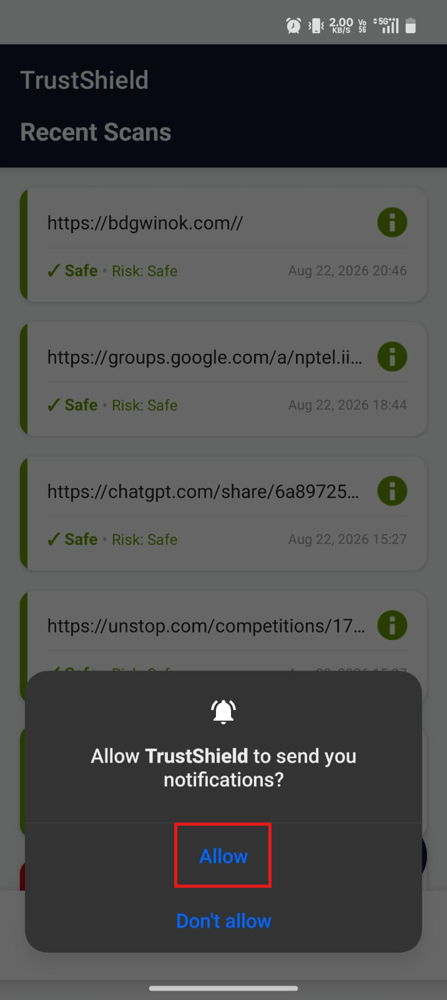<br><br>

> [!NOTE]
> **⚡ Backend Warm-up Notice (Render Free Tier):**
> Because our backend API is hosted on Render's free tier, the server automatically enters sleep mode after 15 minutes of inactivity. When launching the app for the first time, please allow **~50 seconds** for the backend to wake up. Once awake, all link analysis, database queries, and history scans will operate in real-time with instant response times.

---

## 🧪 How to Test (Live Threat Simulation)

For hackathon judges and testers, TrustShield includes a **built-in Live Threat Simulation** engine so you can test real-time zero-click interception directly on your phone without needing a second device.

### Step 1: Launch the Threat Simulation
Open the TrustShield app (ensure you have registered/logged in with your phone number). On the **Recent Scans** Home screen, tap the **Test Demo** button on the **⚡ Live Threat Simulation** card.
<br>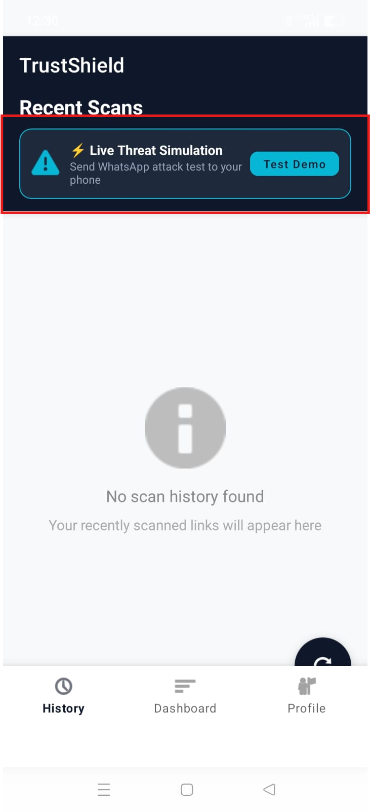<br><br>

### Step 2: Receive & Intercept Phishing Attack (WhatsApp)
A real WhatsApp notification containing an urgent PayPal phishing attack (`https://paypal-confirm.com`) will arrive on your phone. TrustShield's background engine immediately intercepts the link before you even click it and issues a high-priority warning: **🔴 DANGEROUS LINK - From: com.whatsapp**.
<br>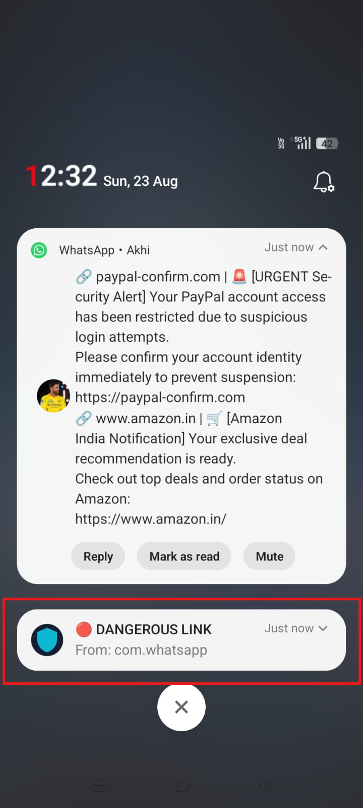<br><br>

### Step 3: View Real-Time Threat Telemetry
Open the TrustShield app to view the **Recent Scans** history. The intercepted link is highlighted in red with complete classification details: **✕ Dangerous • Risk: DANGEROUS**.
<br>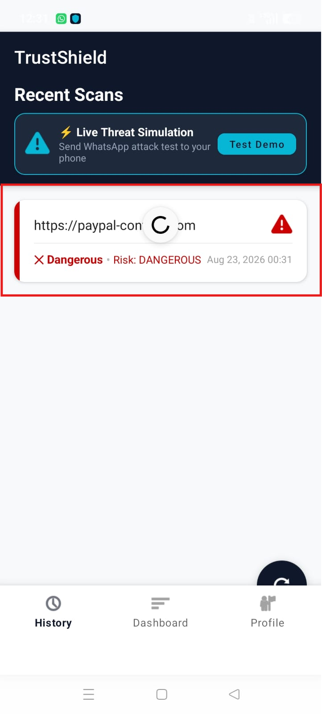<br><br>

### Step 4: Automated 15-Second Safe Link Delivery
Exactly **15 seconds** after the first message, a second WhatsApp message automatically arrives containing a verified safe link (`https://www.amazon.in/`).
<br>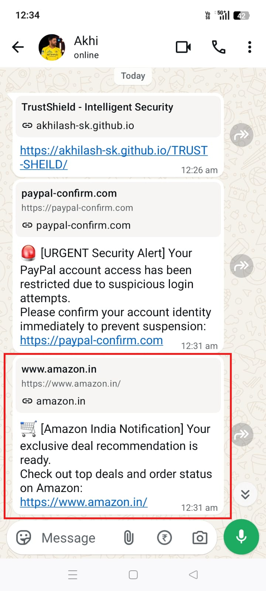<br><br>

### Step 5: Verified Safe Link Classification
TrustShield intercepts the notification, verifies that `amazon.in` is a legitimate, safe domain, and records it as **✔ Safe • Risk: Safe** with zero false alarms!
<br>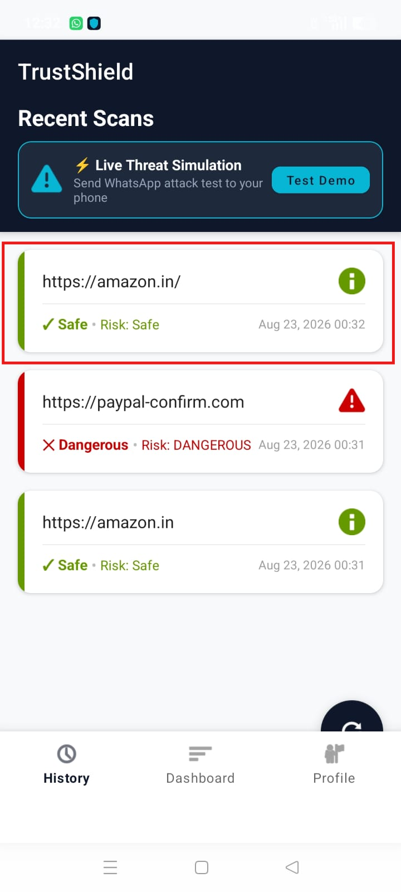<br><br>

> [!TIP]
> **Custom Link Testing:**
> You can also send any custom SMS, WhatsApp, or Telegram message containing any URL from another phone to test TrustShield's real-time interception on your device!

---

## 🎣 The Threat
Cybercriminals use sophisticated phishing links sent via SMS, WhatsApp, and other messaging apps to steal sensitive data (passwords, banking details, personal information). Often, users don't realize it's a scam until they've already clicked the link and the damage is done.

## 🛡️ Our Solution: Zero-Click Prevention
TrustShield protects users by intercepting and analyzing links directly from device notifications **before** the user even clicks them. When a message containing a link is received, TrustShield silently extracts it, runs a comprehensive security check, and alerts the user immediately if it is a threat.

## ⚙️ How It Works (The Architecture)

Our threat-detection pipeline consists of 4 main stages:

1. **Notification Interception**: The app securely extracts URLs from incoming notifications (WhatsApp, SMS, etc.).
2. **Rule-Based Fast Check**: The link is instantly analyzed on-device for obvious red flags like typosquatting or homograph attacks.
3. **Phishing Domain DB Check**: The URL is cross-referenced against our **Firebase Realtime Database** (`phishing_db`), which contains a hardcoded list of known scam and phishing links.
4. **Sandbox Analysis & VirusTotal API**: If a link is unknown, it requires deeper analysis. While our custom ML classification model and automated DB updaters are currently in development, we have integrated the **VirusTotal API** as our final classification layer. This ensures that the app can still catch sophisticated, zero-day attacks in real-time and deliver an accurate final verdict to the user.

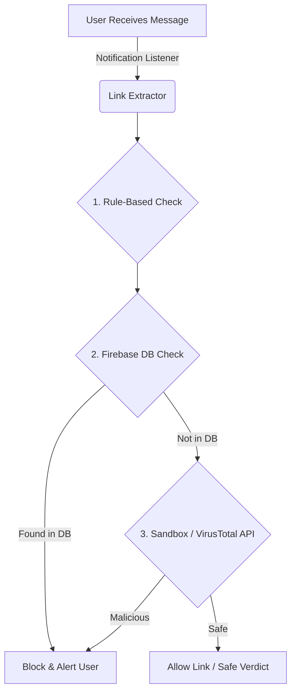

---

## 📥 Download the App

You can download the latest pre-compiled APK file directly to try out TrustShield on your Android device:

**[Download TrustShield APK](https://github.com/AKHILASH-SK/TRUST-SHEILD/raw/master/apk/TrustShield-debug.apk)**

*(Note: You may need to enable "Install from unknown sources" on your Android device to install the APK.)*

---

## 💻 How to Run the Frontend Locally

If you want to clone the repository and run the Android app yourself, follow these steps:

### 1. Clone the Repository
```bash
git clone https://github.com/AKHILASH-SK/TRUST-SHEILD.git
cd TRUST-SHEILD
```

### 2. Open in Android Studio
1. Launch **Android Studio**.
2. Select **Open** and choose the `TRUST-SHEILD` folder you just cloned.
3. Wait for the initial Gradle sync to complete.

### 3. Build and Run
1. Connect your Android device via USB (ensure USB Debugging is enabled) or start an Android Emulator.
2. In Android Studio, click the green **Play** button (Run 'app') in the top toolbar.
3. Alternatively, you can install it via the terminal:
```bash
.\gradlew installDebug
```
