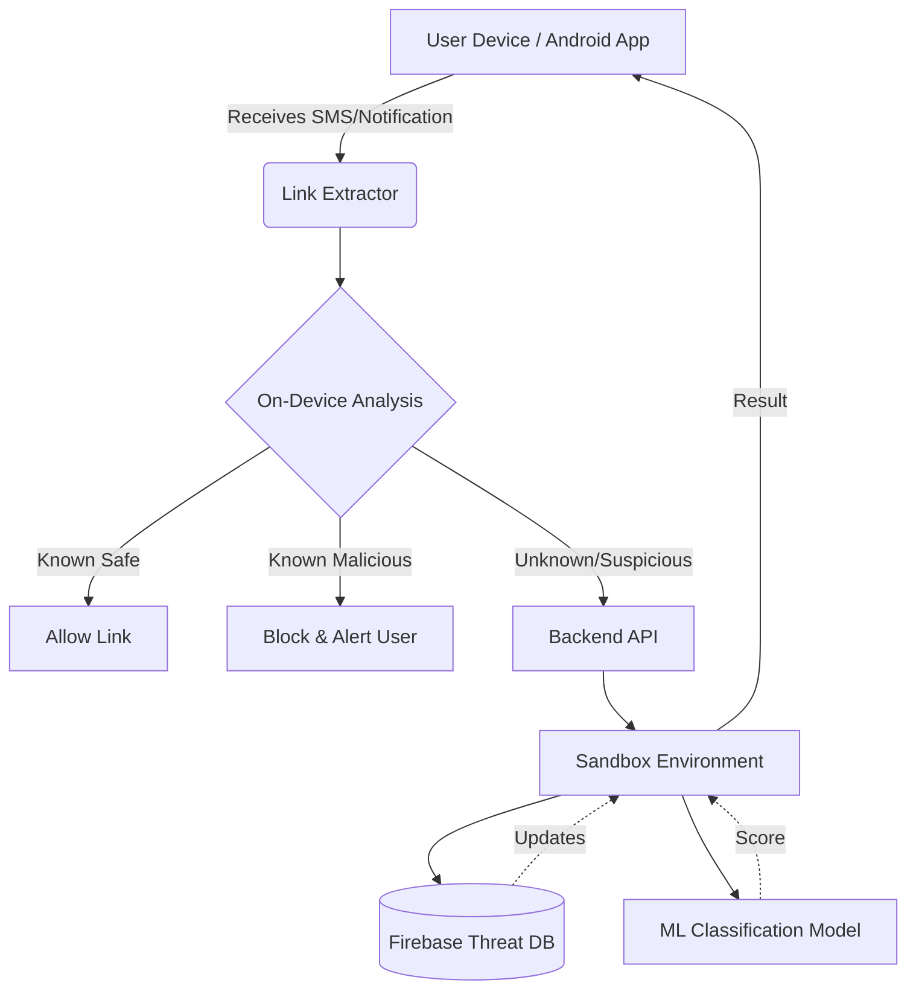

# TrustShield 🛡️

TrustShield is a real-time intelligent security application designed exclusively to protect users from malicious phishing links before any damage occurs.

## 🎣 What is Phishing?

Phishing is a type of cyberattack where attackers deceive users into revealing sensitive information—such as passwords, banking details, or personal data—by impersonating a trustworthy entity in a digital communication. 

TrustShield actively combats this by:
- **Real-Time Monitoring**: Automatically scanning incoming messages and notifications for suspicious URLs.
- **On-Device Analysis**: Instantly validating URLs against known malicious patterns and domains to minimize latency.
- **Backend Sandbox Verification**: Sending uncertain links to a secure backend for comprehensive, isolated analysis.
- **Instant Alerts**: Warning you with a clear, detailed threat analysis before you accidentally open a dangerous link.

---

## 🏗️ Architecture Diagram



---

## 📥 Download the App

You can download the latest pre-compiled APK file directly to try out TrustShield on your Android device:

**[Download TrustShield APK](https://github.com/AKHILASH-SK/TRUST-SHEILD/raw/master/apk/TrustShield-debug.apk)**

*(Note: You may need to enable "Install from unknown sources" on your Android device to install the APK.)*

---

## 💻 How to Run the Frontend Locally

If you want to clone the repository and run the Android app yourself, follow these steps:

### 1. Clone the Repository
Open your terminal and run:
```bash
git clone https://github.com/AKHILASH-SK/TRUST-SHEILD.git
cd TRUST-SHEILD
```

### 2. Open in Android Studio
1. Launch **Android Studio**.
2. Select **Open** and choose the `TRUST-SHEILD` folder you just cloned.
3. Wait for the initial Gradle sync to complete.

### 3. Build and Run
1. Connect your Android device via USB (ensure USB Debugging is enabled) or start an Android Emulator.
2. In Android Studio, click the green **Play** button (Run 'app') in the top toolbar.
3. Alternatively, you can install it via the terminal:
```bash
# On Windows
.\gradlew installDebug

# On macOS/Linux
./gradlew installDebug
```
