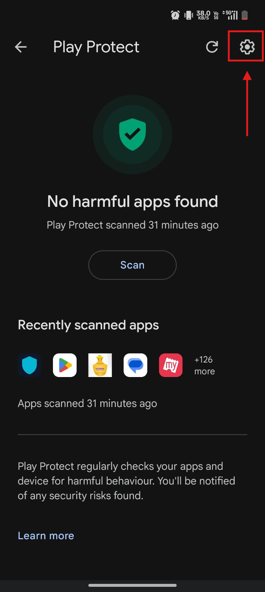
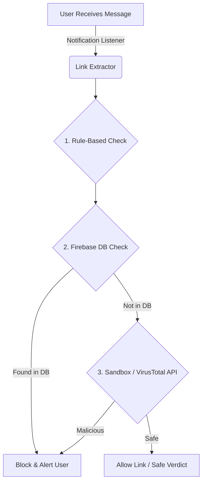

# TrustShield 🛡️

TrustShield is a real-time intelligent security application designed exclusively to protect users from malicious phishing links before any damage occurs.

## 📱 How to Install (For Hackathon Judges)

Since TrustShield is an unreleased app that requests powerful background system permissions (Notification Access) to achieve its "Zero-Click" threat prevention, Android will apply strict security measures by default. Please follow these two steps to install and test the app.

### Step 1: Disable Google Play Protect
Before downloading the APK, you must temporarily pause Google Play Protect so it doesn't block the unverified debug installation.

1. Open the **Google Play Store** app and tap your profile picture.


2. Select **Play Protect** and tap the **Settings (gear icon)** in the top right.


3. Turn off **Scan apps with Play Protect**. We highly recommend selecting the **"Pause"** option so it turns back on automatically the next day, rather than turning it off permanently.


*(You can now safely install the downloaded APK!)*

### Step 2: Allow Restricted Settings for Notification Access
Because TrustShield intercepts notifications to scan for threats, you must grant it Notification Access. On modern Android versions, sideloaded apps have this setting "Restricted" by default.

1. When you open TrustShield and try to enable Notification Access, Android may say **"Restricted Setting"**. Click OK.


2. Go to your phone's Settings -> Apps -> **TrustShield** (or long-press the TrustShield app icon and tap **App Info**). Tap the **three dots** in the top right corner.


3. Tap **Allow restricted settings**. You may be asked to authenticate with your fingerprint or PIN.


4. Finally, return to the TrustShield app, click Enable again, and you will now be able to grant the Notification Access permission successfully!

## 🎣 The Threat
Cybercriminals use sophisticated phishing links sent via SMS, WhatsApp, and other messaging apps to steal sensitive data (passwords, banking details, personal information). Often, users don't realize it's a scam until they've already clicked the link and the damage is done.

## 🛡️ Our Solution: Zero-Click Prevention
TrustShield protects users by intercepting and analyzing links directly from device notifications **before** the user even clicks them. When a message containing a link is received, TrustShield silently extracts it, runs a comprehensive security check, and alerts the user immediately if it is a threat.

## ⚙️ How It Works (The Architecture)

Our threat-detection pipeline consists of 4 main stages:

1. **Notification Interception**: The app securely extracts URLs from incoming notifications (WhatsApp, SMS, etc.).
2. **Rule-Based Fast Check**: The link is instantly analyzed on-device for obvious red flags like typosquatting or homograph attacks.
3. **Phishing Domain DB Check**: The URL is cross-referenced against our **Firebase Realtime Database** (`phishing_db`), which contains a hardcoded list of known scam and phishing links.
4. **Sandbox Analysis & VirusTotal API**: If a link is unknown, it requires deeper analysis. While our custom ML classification model and automated DB updaters are currently in development, we have integrated the **VirusTotal API** as our final classification layer. This ensures that the app can still catch sophisticated, zero-day attacks in real-time and deliver an accurate final verdict to the user.



## 🧪 How to Test

> [!WARNING]
> **Backend Sleep Mode (Important for Testing):** Our Python backend is currently hosted on Render's free tier. If the backend has been inactive for 15 minutes, it goes to sleep. **When you open the app for the first time, you may need to wait around 50 seconds** for the backend to wake up and load properly before tests will work. Please keep the app open for a minute if it's your first time launching it!

To easily test TrustShield's capabilities, we have seeded our Firebase database with known scam links. 

**How to test the Phishing DB:**
1. Install the app and grant the necessary Notification access permissions.
2. Send the following message to the device (via SMS, WhatsApp, or any messenger):
   👉 `https://paypal-security-verify.com/confirm-account`
3. TrustShield will instantly intercept the notification and flag it as a severe phishing attempt because it matches a known threat in our database.

**How to test the API fallback:**
1. Send a real, legitimate link (e.g., `https://google.com` or `https://github.com`) to the device.
2. TrustShield will analyze it, realize it is not in the malicious database, check it against the external APIs, and return a "Safe" verdict.

---

## 📥 Download the App

You can download the latest pre-compiled APK file directly to try out TrustShield on your Android device:

**[Download TrustShield APK](https://github.com/AKHILASH-SK/TRUST-SHEILD/raw/master/apk/TrustShield-debug.apk)**

*(Note: You may need to enable "Install from unknown sources" on your Android device to install the APK.)*

---

## 💻 How to Run the Frontend Locally

If you want to clone the repository and run the Android app yourself, follow these steps:

### 1. Clone the Repository
```bash
git clone https://github.com/AKHILASH-SK/TRUST-SHEILD.git
cd TRUST-SHEILD
```

### 2. Open in Android Studio
1. Launch **Android Studio**.
2. Select **Open** and choose the `TRUST-SHEILD` folder you just cloned.
3. Wait for the initial Gradle sync to complete.

### 3. Build and Run
1. Connect your Android device via USB (ensure USB Debugging is enabled) or start an Android Emulator.
2. In Android Studio, click the green **Play** button (Run 'app') in the top toolbar.
3. Alternatively, you can install it via the terminal:
```bash
.\gradlew installDebug
```
