# TrustShield 🛡️

TrustShield is a real-time intelligent security application designed exclusively to protect users from malicious phishing links before any damage occurs.

---

## 📥 Download the App

You can download and install the latest TrustShield APK directly from our official portal:

👉 **[Download TrustShield for Android (Official Portal)](https://akhilash-sk.github.io/TRUST-SHEILD/)**

*(Note: Follow the step-by-step installation instructions below to ensure all real-time security interception features function seamlessly.)*

---

## 📱 How to Install

Follow the step-by-step visual instructions below to install TrustShield and grant it the required security permissions.

---

### Phase 1: Pause Google Play Protect
Before installing the debug APK, temporarily pause Google Play Protect so Android doesn't block the unverified installation.

1. Open the **Google Play Store** app and tap your **Profile Icon** in the top right.
<br>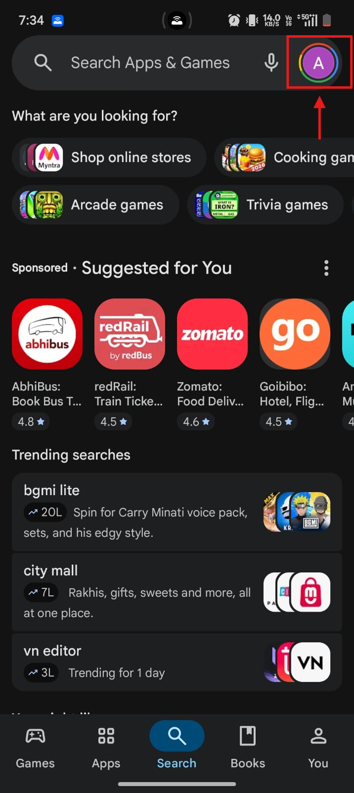<br><br>

2. Tap on **Play Protect** from the menu.
<br>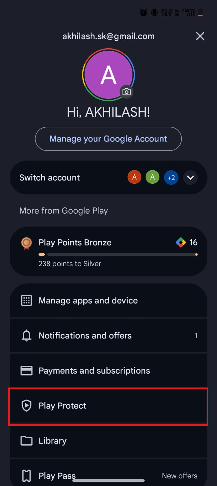<br><br>

3. Tap the **Settings (gear icon)** in the top right corner.
<br>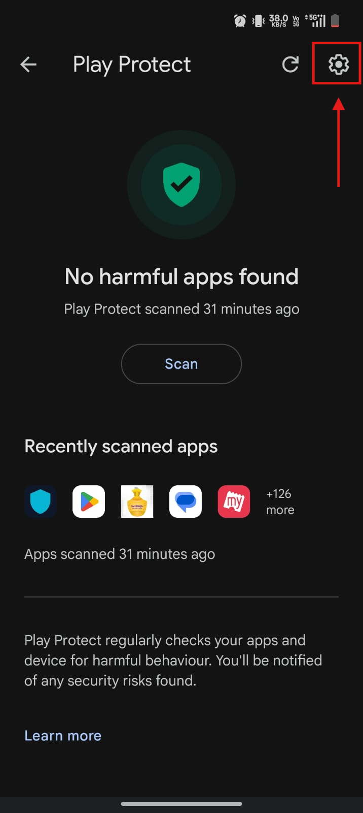<br><br>

4. Toggle off **Scan apps with Play Protect**.
<br>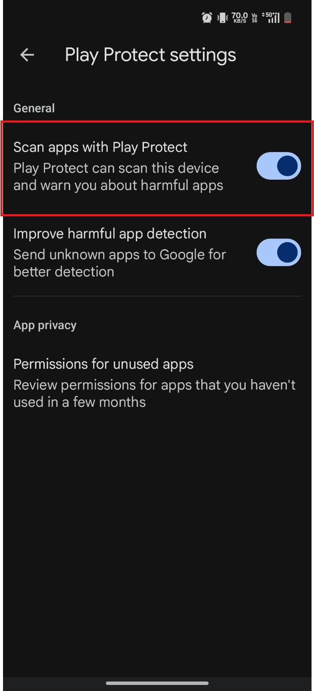<br><br>

5. When the confirmation dialog appears, tap **Pause** (this temporarily pauses scanning for 24 hours so it turns back on automatically).
<br>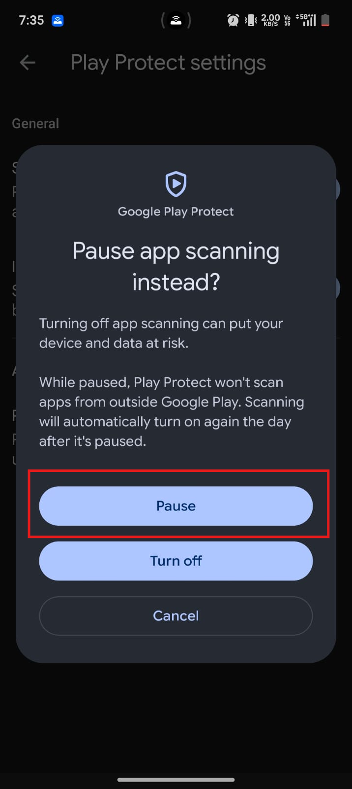<br><br>

6. Verify that app scanning shows **"App scanning is paused"**.
<br>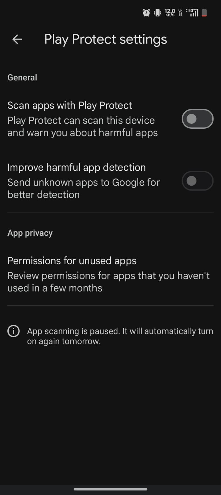<br><br>

---

### Phase 2: Download & Install APK

7. Open the download portal at **[https://akhilash-sk.github.io/TRUST-SHEILD/](https://akhilash-sk.github.io/TRUST-SHEILD/)** and tap **Download for Android**. If Google Chrome displays a *'File might be harmful'* warning, tap **Download anyway** to complete the download.
<br>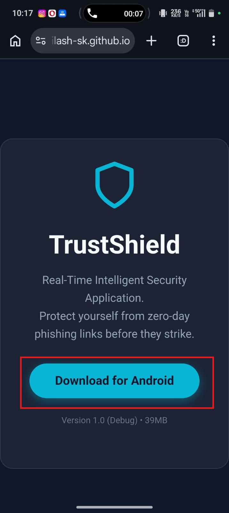<br><br>

8. Open the downloaded `TrustShield-debug.apk` file from your notification bar or Downloads folder and select **Package installer** to install the application.
<br>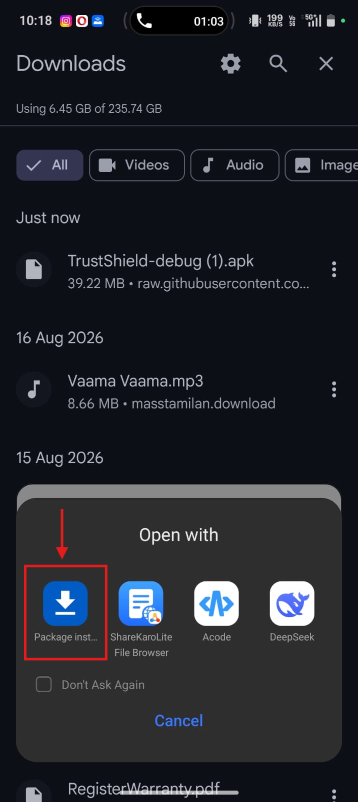<br><br>

---

### Phase 3: Allow Restricted Settings for Notification Access
Because TrustShield intercepts notifications to protect against zero-day phishing in real-time, sideloaded apps on Android require manually allowing restricted settings.

9. Long-press the **TrustShield** app icon on your home screen or app drawer and tap **App info** (ℹ️).
<br>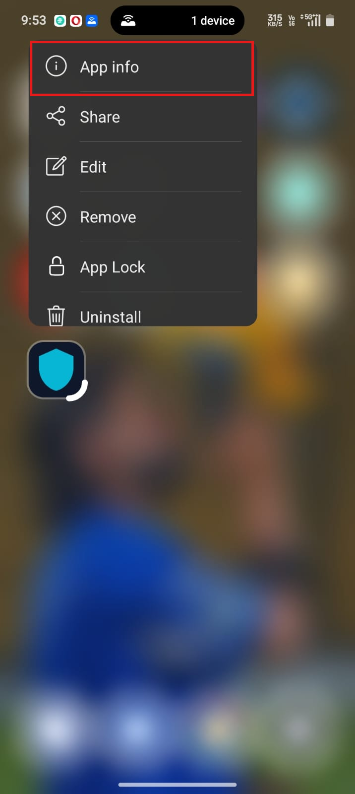<br><br>

10. Tap the **three dots (⋮)** in the top right corner and select **Allow restricted settings** (authenticate with your PIN or fingerprint if prompted).
<br>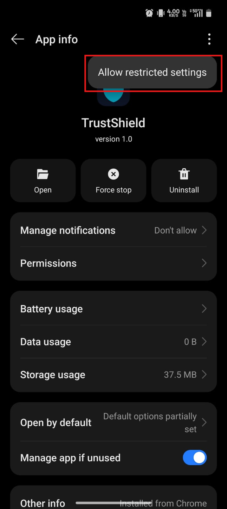<br><br>

11. Open the **TrustShield** app and tap **ENABLE NOTIFICATION ACCESS** on the Special Access screen.
<br>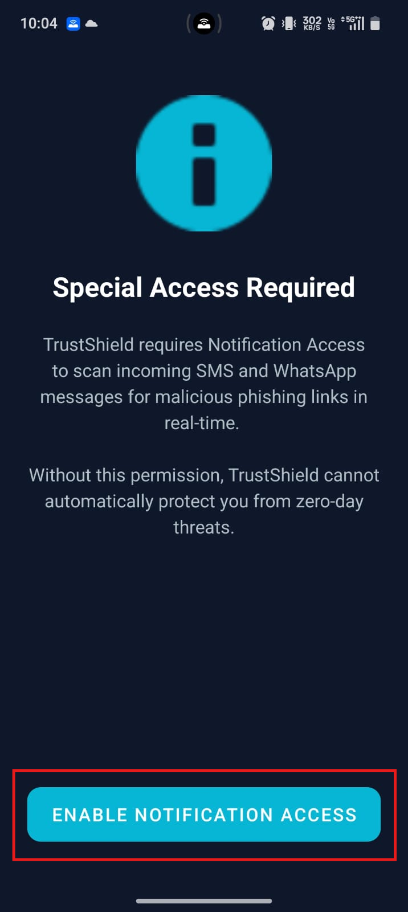<br><br>

12. In the Android **Device & app notifications** list, select **TrustShield**.
<br>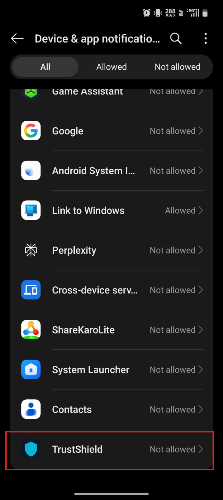<br><br>

13. Turn on the **Allow notification access** switch and tap **Allow** on the confirmation dialog.
<br>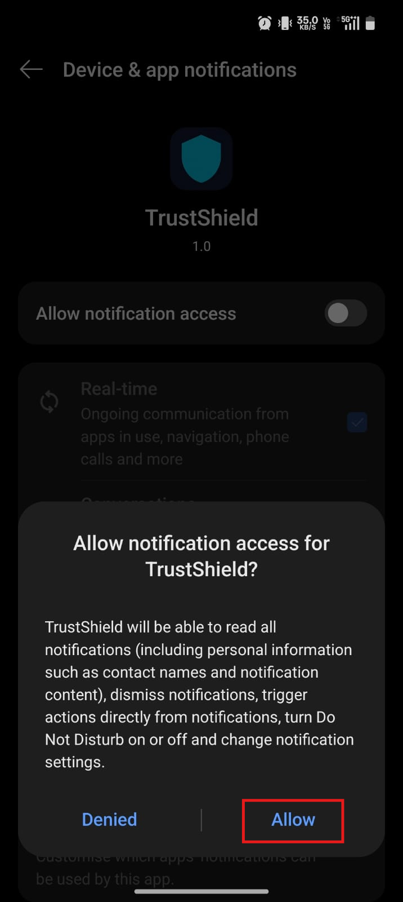<br><br>

14. Confirm that the **Allow notification access** toggle is enabled (blue / ON).
<br>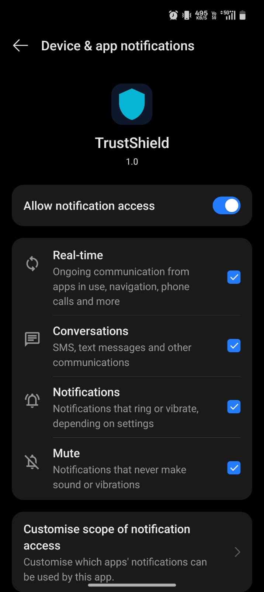<br><br>

15. Return to the TrustShield app; when the system prompt asks **"Allow TrustShield to send you notifications?"**, tap **Allow**.
<br>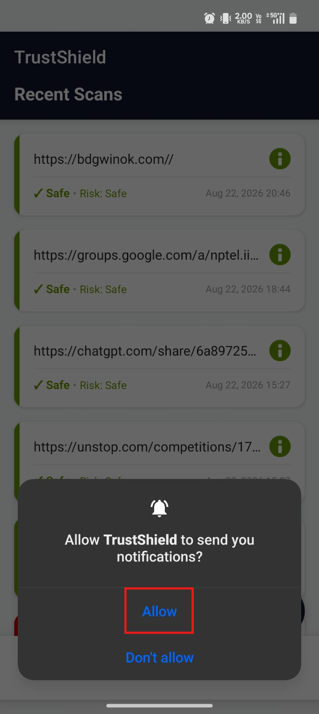<br><br>

> [!NOTE]
> **⚡ Backend Warm-up Notice (Render Free Tier):**
> Because our backend API is hosted on Render's free tier, the server automatically enters sleep mode after 15 minutes of inactivity. When launching the app for the first time, please allow **~50 seconds** for the backend to wake up. Once awake, all link analysis, database queries, and history scans will operate in real-time with instant response times.

---

## 🧪 How to Test

The earlier built-in WhatsApp "Test Demo" button was removed (it relied on a third-party messaging account). Test the real flow instead:

1. Install the app, register or log in with your phone number, and grant notification access (see the installation steps above).
2. From **another phone** (or another app on the same phone, e.g. Telegram "Saved Messages"), send yourself a message containing a link.
   * Try a legitimate link such as `https://www.amazon.in/` -> recorded as **Safe**.
   * Try a link from a public phishing feed such as OpenPhish (do **not** open it) -> flagged **Suspicious/Dangerous** with the reasons shown.
3. Open the app's **Recent Scans** to see the verdict, the reasons and the source app (WhatsApp, SMS, Telegram ...).

> [!TIP]
> You can also paste any link into the manual scan box on the Home screen.

---

## 🎣 The Threat
Cybercriminals use sophisticated phishing links sent via SMS, WhatsApp, and other messaging apps to steal sensitive data (passwords, banking details, personal information). Often, users don't realize it's a scam until they've already clicked the link and the damage is done.

## 🛡️ Our Solution: Zero-Click Prevention
TrustShield protects users by intercepting and analyzing links directly from device notifications **before** the user even clicks them. When a message containing a link is received, TrustShield silently extracts it, runs a comprehensive security check, and alerts the user immediately if it is a threat.

## ⚙️ How It Works (The Architecture)

Our threat-detection pipeline consists of 4 main stages:

1. **Notification Interception**: The app securely extracts URLs from incoming notifications (WhatsApp, SMS, etc.).
2. **Rule-Based Fast Check**: The link is instantly analyzed on-device for obvious red flags like typosquatting or homograph attacks.
3. **Phishing Domain DB Check**: The URL is cross-referenced against our **Firebase Realtime Database** (`phishing_db`), which contains a hardcoded list of known scam and phishing links.
4. **Sandbox Analysis & VirusTotal API**: If a link is unknown, it requires deeper analysis. The server combines URL heuristics, a continuously synced threat feed, VirusTotal reputation, page analysis in a sandbox, and a rule-based decision engine. A trained machine-learning stage is implemented but is **not enabled until a model has been trained and evaluated**; no accuracy figure is claimed until then.

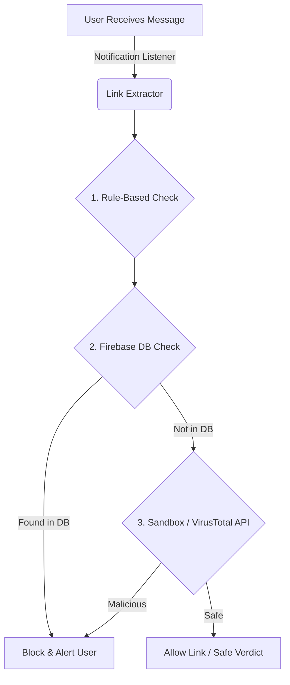
```mermaid
graph TD
    A[User Receives Message] -->|Notification Listener| B(Link Extractor)
    B --> C{1. Rule-Based Check}
    C --> D{2. Firebase DB Check}
    D -->|Found in DB| E[Block & Alert User]
    D -->|Not in DB| F{3. Sandbox / VirusTotal API}
    
    F -->|Malicious| E
    F -->|Safe| G[Allow Link / Safe Verdict]
```

---

## 💻 How to Run the Frontend Locally

If you want to clone the repository and run the Android app yourself, follow these steps:

### 1. Clone the Repository
```bash
git clone https://github.com/AKHILASH-SK/TRUST-SHEILD.git
cd TRUST-SHEILD
```

### 2. Open in Android Studio
1. Launch **Android Studio**.
2. Select **Open** and choose the `TRUST-SHEILD` folder you just cloned.
3. Wait for the initial Gradle sync to complete.

### 3. Build and Run
1. Connect your Android device via USB (ensure USB Debugging is enabled) or start an Android Emulator.
2. In Android Studio, click the green **Play** button (Run 'app') in the top toolbar.
3. Alternatively, you can install it via the terminal:
```bash
.\gradlew installDebug
```

---

## 🖥️ How to Run the Backend Locally

To run the Python analysis & API server on your local machine:

### 1. Navigate to Backend Directory
```bash
cd backend
```

### 2. Install Dependencies
```bash
pip install -r requirements.txt
```

### 3. Start the Server
```bash
python app.py
```

The backend server will start at `http://localhost:8000`.

---

## 🔌 Running Everything Locally (Laptop + Testing Phone)

> ⚠️ **Please change the IP address in the places listed below so that it matches YOUR laptop, otherwise the app will not be able to reach the backend.**

### 1. Put the laptop and the phone on the same network
- Turn on the **Mobile Hotspot of the testing phone** and connect the **laptop to that hotspot's Wi-Fi**. The laptop and the phone must be on the same network, otherwise the app cannot reach the backend.
- Keep the laptop connected to the **same hotspot** for the whole session. If you disconnect and reconnect (or switch to another Wi-Fi), the laptop's IP can change, and you must repeat step 2.

### 2. Find your laptop's IP address and put it in the project's `.env`
1. On the laptop open **PowerShell** and run `ipconfig`. Under the **Wi-Fi** adapter, copy the **IPv4 Address** (for example `10.93.230.61`).
2. In the project's **root folder**, copy `.env.example` to `.env` (only the first time) and set:
   ```
   BACKEND_ENV=local
   BACKEND_IP=<your laptop's IPv4 address from ipconfig>
   BACKEND_PORT=8000
   ```
3. **Rebuild and reinstall the app** so it picks up the new address (the IP is built into the app):
   ```bash
   .\gradlew installDebug
   ```
   *(Never commit your `.env` file; it is private to your machine.)*

> The **Chrome extension** and the **SOC portal** run on the laptop itself and already use `127.0.0.1` / `localhost`, so they need **no IP change** when you use them on the same laptop.

### 3. Start the backend
```bash
cd backend
python app.py
```
Wait about 40 seconds, then check `http://localhost:8000/api/health`, which should answer OK. Keep this window open while you test.
If the phone still cannot reach it, allow Python through the Windows Firewall for **Public** networks (hotspot networks are usually treated as Public).

### 4. Open the SOC Portal locally
- On the laptop: **http://localhost:8000/portal/**
- From another device on the same hotspot (for example a second phone): **http://&lt;your-laptop-IP&gt;:8000/portal/**

Press **Ctrl + F5** once if the page looks old.

### 5. Optional: check everything and run the impersonation demo
```powershell
cd backend
powershell -ExecutionPolicy Bypass -File tools\run_all_checks.ps1 -Quick     # tests + false-positive checklist (about 1 minute)
powershell -ExecutionPolicy Bypass -File lab\run_demo.ps1 -Pause               # the "person in the middle" demo (about 3 minutes)
```
The demo never restarts or closes the running backend. After starting it, open the portal and click **Mail Gateway**.
More detail: **`REHEARSAL_AND_RUN_SHEET.md`** (copy-paste run sheet) and **`IMPERSONATION_AND_GATEWAY_GUIDE.md`** (how it works, and judge Q&amp;A).

